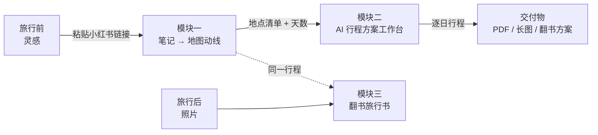
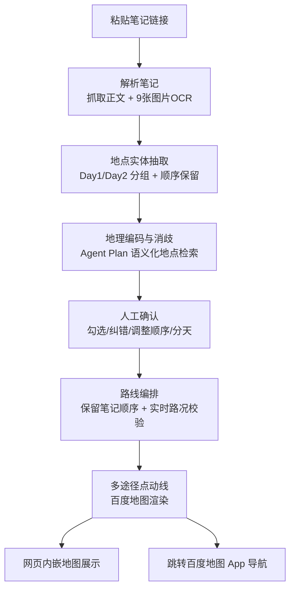

# 旅行全流程助手 · PRD（工作名：TripFlow / 旅记）

> 文档性质：产品需求文档（PRD）
> 版本：**v0.3（范围已锁定）**
> 赛事：百度地图开发者创作大赛（lbs.baidu.com）
> 关联资产：
> - 模块二已实现：`https://github.com/CageEcho/xingce-travel-planner`（「行策」zAI Travel Bot）
> - 模块三 demo：`https://github.com/CageEcho/Travel-book`（「翻书旅行方案」，已公开）

---

## 0. 一句话定位

**复制一篇小红书攻略 → 自动生成百度地图多途径点动线**，并可进一步在 AI 工作台确认需求产出图文行程方案、旅行后整理成翻书式旅行书。

---

## 1. 已确认决策（本次范围锁定）

| # | 问题 | 结论 |
|---|---|---|
| 1 | 笔记输入方式 | 用户粘贴链接；**比赛 demo 用预设链接** `https://xhslink.cn/o/10vTPLjLXy7`（重庆特种兵2日游） |
| 2 | 地图/API | 百度地图 **Agent Plan（Map Agent Plan）**：一个 Token + MCP，含地点检索/路线规划/实时路况/地理编码/天气，免费内测 |
| 3 | 产品形态 | **首期 Web 端** |
| 4 | 登录 | **MVP 不做登录**，用「行程链接」弱关联 |
| 5 | 城市范围 | **北京、上海、广州、深圳、重庆、成都** 6 城 |
| 6 | 模块三形态 | Travel-book 实际是「翻书旅行方案」交付格式，重新定位（见 §6） |
| 7 | 实时路况接入 | Agent Plan 免费含实时路况，**成本≈0，接入**（用于路线规划的「结合实时路况」维度） |
| 8 | 成功指标 | 采用 §9 指标体系 |
| 9 | 多途经点 | Agent Plan 路线规划支持多途经点，**单次上限 20 个** |
| 10 | 小红书取数策略 | **稳定性优先**：预抓取快照兜底 + 公开页面解析（§4.7 已跑通），不做实时强依赖 |
| 11 | 模块三定位 | 翻书方案 = **核心交付物**（非加分展示） |
| 12 | 地图长图导出 | 支持导出，**要求极高审美与品质**（FR-1.8） |

---

## 2. 背景与问题

| 痛点 | 现状 | 本产品如何解决 |
|---|---|---|
| 小红书攻略景点多，得一个个手打进地图 | 用户复制粘贴、逐个搜索、手动排序 | 粘贴笔记链接 → 自动抽取地点 → 生成多途径点动线地图 |
| 定制行程靠聊天机器人，输出泛化文案 | 拿不到结构化、可核验、可交付的方案 | 结构化需求卡 + 人机确认 + 资源池编排 + 约束/成本校验 + 图文交付 |
| 行程交付/旅行回忆没有「可翻页」的呈现 | PDF 生硬、照片散落 | 翻书式旅行方案/旅行书 |

**本次比赛主攻 = 模块一（笔记 → 地图动线）**；模块二整合为需求确认能力，**模块三翻书方案为核心交付物**。

---

## 3. 产品全景



| 模块 | 名称 | 状态 |
|---|---|---|
| 模块一 | 笔记转地图（灵感变现） | **本次比赛核心，全新** |
| 模块二 | AI 行程方案工作台（行策） | 已有完整实现 |
| 模块三 | 翻书旅行方案/旅行书（旅记） | 已有 demo，重新定位 |

---

## 4. 模块一：小红书笔记 → 百度地图动线（比赛核心）

### 4.1 演示笔记（预设，已抓取核实）

| 项 | 内容 |
|---|---|
| 链接 | `https://xhslink.cn/o/10vTPLjLXy7` → 笔记 `6a7090860000000025002d58` |
| 标题 | 重庆｜特种兵不绕路2日游‼️ |
| 正文 | 仅一句话简介，**路线内容全部在 9 张图片中** |
| Day1（顺序已排） | 解放碑 → 山城步道 → 十八梯 → 白象居 → 湖广会馆 → 来福士 → 洪崖洞 → 江滩公园 |
| Day2（顺序已排） | 鹅岭公园 → 鹅岭二厂 → 李子坝 → 人民大礼堂 → 三峡博物馆 → 观音桥 → 北仓文创园 → 塔坪 |
| 附加图 | 避雷版（哈儿果/铜人拍照/竹筒奶茶…）、小吃版（熨斗糕/糯米团/黔江鸡杂…）、美食版（周师兄火锅/莉姐火锅/四平饭店/纪大妈蹄花）、礼物版（白真真首饰店） |

> **关键结论**：这篇笔记正文几乎无信息，**图片 OCR 是提取地点的关键路径**，纯文本抽取会失败。因此模块一的技术链路必须包含「图片抓取 + OCR」。

### 4.2 用户故事

> 作为自由行用户，我在小红书看到这篇重庆攻略，复制链接粘贴进网页，点击生成，就能得到「按 Day1/Day2 分组、顺序与笔记一致、可直达导航」的百度地图多途径点动线，而不是把 16 个景点一个个手打进地图。

### 4.3 核心流程



### 4.4 功能需求（FR）

**FR-1.1 笔记输入**
- 支持粘贴小红书笔记链接（短链 `xhslink.cn` / App 分享文本 / 完整 URL）。
- 首页预置 demo 链接，一键「试试这篇重庆攻略」。
- 降级输入：直接粘贴正文文本 + 上传截图 OCR。

**FR-1.2 笔记内容解析（含 OCR）**
- 抓取标题、正文、图片列表（本 demo 为 9 张图）。
- 图片走 OCR（中文），提取景点/美食/避雷清单文字。
- 输出结构化字段：`[城市, 所属天, 顺序号, 地点名, 类型(景点/美食/其他)]`。

**FR-1.3 地点实体抽取与消歧**
- 以 6 城为上下文约束（重庆的解放碑 ≠ 其他城市）。
- 保留笔记**原始顺序**（笔记自称「不绕路版」，顺序是用户价值，默认不重排）。
- 别称/俗称（如「李子坝」→ 李子坝轻轨站观景平台）交给 POI 检索消歧。

**FR-1.4 地理编码（Agent Plan）**
- 对每个地点调用 Agent Plan 语义化地点检索，得到 `经纬度 + POI id + 名称 + 地址`。
- 检索失败的地点标记，给候选列表让用户手选或跳过。

**FR-1.5 人工确认关卡（必做）**
- 展示地点清单：名称、类型、Day 分组、顺序、地图位置、来源（OCR 原文）。
- 用户可：勾选/取消、改名、换 POI、上下拖动排序、调整分天。
- 未确认前不生成动线。

**FR-1.6 路线编排**
- 默认**保留笔记顺序**，按 Day 分组展示。
- 结合 Agent Plan 路线规划（驾车/步行/骑行/公交）+ 实时路况，给出每段交通方式建议与耗时（**成本≈0，已接入**）。
- 顺序明显不合理时（如两点距离过远）给出「优化建议」，由用户决定是否采纳。

**FR-1.7 地图输出**
- **网页内嵌**：百度地图 JSAPI GL 渲染多途径点动线，逐天切换、地点卡片、交通耗时。
- **跳转 App**：一键唤起百度地图 App 传入起点/终点/途经点导航。
- **分享**：生成短链（无登录），对方打开看到同一份动线（只读）。

**FR-1.8 地图长图导出（高审美）**
- 一键导出「路线长图」：封面 + 逐天动线地图 + 地点卡片 + 交通耗时 + 小结。
- **极高审美与品质**：设计稿级排版（统一字体/配色/留白/图例），≥2x 高清分辨率，作为核心分享载体。

### 4.5 验收标准（模块一）

| 编号 | 验收标准 |
|---|---|
| AC-1.1 | 粘贴 demo 链接，30s 内从 9 张图 OCR 提取出 16 个景点，召回率 ≥ 80%，Day1/Day2 分组与顺序与笔记一致 |
| AC-1.2 | 16 个景点中 ≥ 70% 自动匹配到正确 POI 经纬度 |
| AC-1.3 | 人工确认前不生成动线；用户可纠正任意地点/顺序 |
| AC-1.4 | 生成的多途径点动线在网页正确渲染，且能跳转百度地图 App 导航 |
| AC-1.5 | 6 城地点消歧正确（含同名/别称） |
| AC-1.6 | 全程记录日志：抓取/OCR/抽取/地理编码/人工改动/生成的耗时与结果 |

### 4.6 边界与风险（模块一）

| 风险 | 说明 | 应对 |
|---|---|---|
| 小红书取数 | 笔记有登录墙/反爬，demo 链接偶发 404 | **稳定性优先**：预抓取快照 + 预设 OCR 结果兜底；实时抓取为增强（参考实现见 §4.7） |
| 图片 OCR 依赖 | 内容全在图里，OCR 是成败关键 | 主路径抓图 OCR；OCR 失败降级「粘贴文字/上传图」 |
| 多途径点数量限制 | 已确认：Agent Plan 路线规划支持多途经点，**单次上限 20 个** | 超 20 个按天/分段拆分渲染 |
| 路线「最优」不可证 | 笔记顺序即价值，不承诺数学最优 | 默认保留顺序 + 实时路况建议，优化仅作建议 |

### 4.7 取数与导出参考实现（已实测跑通）

**小红书取数（已实测可行）**：短链 `xhslink.cn` 302 → 笔记详情页；页面 `window.__INITIAL_STATE__.note.noteDetailMap[noteId].note` 内含 `title / desc / imageList`（本 demo 为 9 张图 URL）。图片直链 `sns-webpic-qc.xhscdn.com` 可直接下载。生产实现 = 请求公开页面 → 解析该 JSON → 下载图片 → OCR（中文）。**不破解登录/付费墙**；demo 以预抓取快照保证稳定性。

**地图长图导出（FR-1.8）**：用无头浏览器对动线地图整页合成高清长图（≥2x 分辨率），封面 + 逐天路线 + 地点卡片 + 交通耗时，排版走设计稿级审美（字体/配色/留白/图例统一），作为核心分享载体。

---

## 5. 模块二：AI 行程方案工作台（「行策」）

> 已有完整实现，本 PRD 只固化需求边界与集成点。

### 5.1 定位

为旅行顾问设计的 AI 行程方案工作台，**不是泛化文案聊天机器人**：

```
客户原话 → 结构化需求卡 → 人机确认 → 资源池筛选与编排 → 约束与成本校验 → 图文 PDF/长图交付
```

### 5.2 核心需求（对齐已有实现）

| 需求 | 说明 |
|---|---|
| 需求拆解为结构化需求卡 | 提取目的地/日期/天数/同行人/预算/酒店档次/饮食禁忌/无障碍/偏好/节奏等槽位；每字段标注来源+置信度 |
| 人机确认关卡 | 必问项不可静默默认；完整度达阈值且冲突项处理后才能生成方案 |
| 资源池筛选与编排 | 硬过滤后生成逐日行程；模型只选资源 ID，服务端回填事实 |
| 约束与成本校验 | 通过/拦截/待核实三态校验；成本由规则引擎计算 |
| 图文交付 | 客户版预览 + A4 多页 PDF + 长图；自动移除内部成本/资源 ID/模型信息 |

### 5.3 与模块一/三的衔接点

| 衔接 | 需求 | 优先级 |
|---|---|---|
| 模块一 → 模块二 | OCR 出的地点清单 + 天数，作为需求卡初始槽位，减少重复录入 | P1 |
| 模块二 → 模块一 | 确认的逐日行程回写为「逐日多途径点地图」 | P2 |
| 模块二 → 模块三 | 行程的「天 × 地点」结构 + 图片，生成翻书式方案 | P1（比赛可展示） |

---

## 6. 模块三：翻书旅行方案 / 旅行书（「旅记」）

> **重要修正**：Travel-book demo 实际是「翻书旅行方案」——把一份行程做成可翻页的小书（土耳其12日、28页：封面/路线图/每日行程/美食/票据/报价/须知/封底），**不是照片相册**。因此重新定位如下。

### 6.1 定位（核心交付物）

「**翻书**」是**核心交付格式**（已确认，非加分展示），复用于两类内容：
1. **行前**：把模块二的行程方案渲染成翻书版方案书（与 PDF/长图并列的核心交付物）。
2. **行后**：把旅行照片 + 行程 + AI 配文，渲染成翻书式旅行书。

### 6.2 功能需求

**FR-3.1 内容来源**
- 行前方案书：输入 = 模块二确认的逐日行程 + 图片（景点图/地图截图）。
- 行后旅行书：输入 = 旅行照片 + 行程结构（可选）。

**FR-3.2 翻书交互（核心，沿用 demo）**
- 书架入口 → 点开像翻真书一样逐页看：封面、路线图、每日行程、美食、封底。
- 支持点击/拖动/滚轮/方向键翻页；两侧扇形叠放页面。
- 移动端横屏友好。

**FR-3.3 自动整理与配文（行后场景）**
- 照片按「天/地点」分组、去重、选封面。
- AI 生成每章标题与当日小结（语气可选）。

**FR-3.4 导出与分享**
- 单文件 HTML（demo 已实现：照片字体打包，离线可看，发人即用）。
- 可导出 PDF/长图；生成分享链接（只读）。

### 6.3 验收标准（模块三）

| 编号 | 验收标准 |
|---|---|
| AC-3.1 | 输入一份行程，产出可翻页 HTML 书，翻页流畅 |
| AC-3.2 | 单文件 HTML 打包后离线可打开、图片字体不缺失 |
| AC-3.3 | 行后照片按天分组准确率 ≥ 85% |
| AC-3.4 | 手动调整后重新生成不覆盖用户编辑 |

---

## 7. 统一账号与数据流（MVP 无登录）

| 数据 | 产生 | 消费 |
|---|---|---|
| 目的地/地点清单/天数 | 模块一 | 模块二（需求卡初始槽位） |
| 逐日行程 | 模块二 | 模块一（逐日地图）、模块三（翻书方案） |
| 翻书书/图片 | 模块三 | 分享 |

- MVP 用「行程 ID + 短链」弱关联，无账号体系。
- 分享链接只读，不可编辑他人行程。

---

## 8. 非功能需求

| 维度 | 要求 |
|---|---|
| 性能 | 模块一抓取+OCR+地理编码+动线生成 P95 ≤ 30s；OCR 慢则先给文字版再异步补地图 |
| 隐私 | 笔记内容、照片仅本次使用；分享走授权短链；不持久化用户 PII（无登录） |
| 安全 | Agent Plan Token / 服务端 AK 不入前端；导出文件不泄露内部成本 |
| 合规 | 小红书抓取方式、百度地图开放平台条款在开发前确认；比赛 demo 用预抓取快照 |
| 可观测 | 抓取/OCR/抽取/地理编码/编排/生成各环节耗时、成功率、人工改动率、分享率 |
| 降级 | 抓取失败→预抓取快照；OCR 失败→粘贴文字/上传图；地理编码失败→手选 POI；模型失败→确定性编排回退 |

---

## 9. 成功指标（已确认采用）

| 层级 | 指标 |
|---|---|
| 北极星 | 每周「从一篇笔记到一份可交付动线/行程」完成的闭环次数 |
| 模块一 | 笔记→动线转化率、地点识别召回率、人工纠错率（越低越好）、分享率 |
| 模块二 | 需求卡确认率、方案生成成功率、约束校验拦截率、交付物导出率 |
| 模块三 | 行程→翻书成书率、分享率、次日留存 |

---

## 10. 里程碑（比赛节奏）

| 里程碑 | 内容 |
|---|---|
| **M0（比赛核心，先做）** | 模块一最小闭环：粘贴 demo 链接 → 预抓取快照+OCR 提取 16 景点 → 人工确认 → Agent Plan 地理编码 → 百度地图多途径点动线（网页 + 跳转 App + 分享短链 + **高审美路线长图导出**） |
| M1 | 模块一 × 模块二打通（地点清单→需求卡）；**模块三翻书方案渲染（核心交付物**，用模块二输出生成翻书 HTML） |
| M2 | 模块二行程 → 逐日地图回写；行后旅行书（照片分组+AI 配文）；实时路况/开放时间增强 |

---

## 11. 结论（两轮确认后无遗留待确认项）

- 多途经点（单次 ≤20）、小红书稳定性策略、模块三核心交付物定位、地图长图高审美导出，均已确认并落入正文。
- 唯一工程化待办：拿到 Agent Plan 内测 Token 后，用真实 Token 验证「多途经点路线规划」的参数形态与 20 上限行为。

---

## 12. 附录：赛事与资产盘点

### 12.1 百度地图开放能力（已核实）

| 能力 | 说明 | 用途 |
|---|---|---|
| **Agent Plan（Map Agent Plan）** | 一个 Token + MCP；语义化 AI 搜索、语义化 AI 路线规划、地理编码/逆地理编码、天气、实时路况；**免费内测** | 模块一核心：地点检索 + 路线规划 + 实时路况 |
| bmap-cli Skills | CLI + Skills，AK 管理/地点搜索/路线导航/地址解析 | 开发期调试 |
| 脉芽 MAPYA | 地图开发智能体，一句话拿方案和代码 | 开发期辅助 |
| 地图 Skills 广场 | 场景化地图技能包 | 按需复用 |
| 传统 Web 服务 API | 地点检索/地理编码/驾车路线规划（含途经点） | Agent Plan 不满足时兜底 |

### 12.2 已有资产

| 资产 | 位置 | 可复用 |
|---|---|---|
| 模块二完整实现 | `github.com/CageEcho/xingce-travel-planner` | 需求卡、资源编排、约束/成本校验、PDF/长图导出 |
| 模块三翻书 demo | `github.com/CageEcho/Travel-book` | 翻书交互、单文件打包（build.py）、28 页排版参考 |
| 演示笔记 | `xhslink.cn/o/10vTPLjLXy7` | 重庆2日游 16 景点 + 避雷/小吃/美食清单 |
| Agent 架构蓝图 | 本目录 `BLUEPRINT.md`（s01–s17） | 模块一落地时架构选型与参考实现 |
