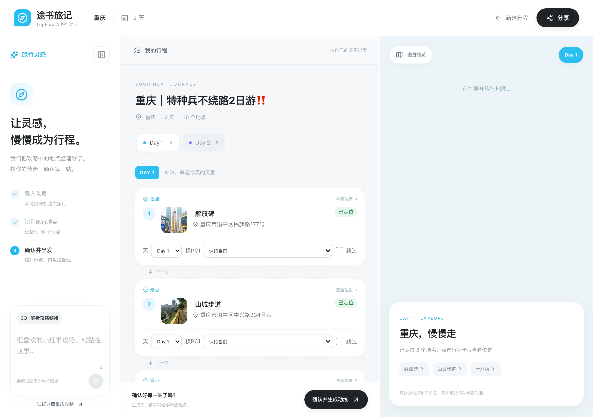

# 本次更新说明（2026-09-30）

本轮按产品反馈做了四处改动：示例攻略只填入输入框、地点卡片加实景小图、每天结尾推荐三档酒店、结果页整体版式保持参考图样式。截图全部来自本机真实运行（`http://127.0.0.1:8002`），行程数据为真实解析的「重庆｜特种兵不绕路2日游」，酒店与图片均为真实接口返回，未使用 mock。

截图尺寸：桌面 1280 宽、手机 375 宽（2 倍像素）。

---

## 01 首页：示例攻略只填入输入框，不自动解析

**看什么**

- 输入框下方右侧「还没想好去哪？试试这篇重庆攻略 ↗」。
- 点击后，示例链接 `https://xhslink.cn/o/10vTPLjLXy7` 出现在输入框里，光标停在输入框中。
- 右侧圆形发送按钮由灰色变为黑色（可点击），页面**没有**跳转、没有开始解析。

**为什么这样改**

原来点示例会立刻提交解析并跳到工作台，用户来不及看清要解析的是什么。现在由用户自己点黑色箭头再开始，和手动粘贴链接的流程一致。行程页左侧栏的同名按钮行为相同。

**怎么验证**

打开首页 → 点「试试这篇重庆攻略」→ 看到链接进入输入框、页面不动 → 再点黑色箭头才开始解析。

---

## 02 地点确认（桌面）：名称前的方形实景小图

**看什么**（中间一栏「我的行程」）

- 每张地点卡片从左到右：**序号圆点 → 56×56 方形实景小图 → 地点名 + 地址 → 「已定位」标签**。
- 图中可见：1 解放碑（纪功碑与周边商圈）、2 山城步道（崖壁栈道），第 3 张十八梯露出一角。
- 卡片下方「天 / 换POI / 跳过」操作行与改版前完全一致，没有被图片挤压。
- 左栏为攻略输入与进度，右栏为地图预览，三栏布局未变。

**交互细节**

- 小图圆角、居中裁切铺满方框，鼠标悬停轻微放大，提示「图片来源：百度百科 · 词条名」。
- 点击小图打开对应百度百科词条，可看原图与介绍。
- 找不到可靠图片的地点不显示小图，卡片其余部分照常。

**图片来源与准确性**

- 取百度百科词条首图；后端下载 720 宽缩略图缓存到本机 `data/assets/{行程ID}/photos/`，再由本服务提供（百科图床禁止外站直接引用）。
- 自动过滤三类错误匹配：同名作品（如「十八梯」首先匹配到小说、「李子坝」匹配到歌曲）、外地同名地点（成都也有「江滩公园」）、标志 / 站牌类白底图（北仓文创园的 logo、李子坝的地铁站牌）。
- 示例行程 16 个地点命中 12 个，12 张逐一人工核对均为对应地点实景；江滩公园、鹅岭二厂、李子坝、北仓文创园没有可靠图片，不展示，不拿无关图片凑数。

---

## 03 地点确认（手机 375 宽）：小图在窄屏同样排在名称前

**看什么**

- 手机上同样是「序号 → 方形小图 → 名称 / 地址 → 已定位」的一行排布，地址过长时以「…」截断，不换行、不撑破卡片。
- 底部固定「确认并生成动线」黑色按钮，以及「行程清单 / 地图预览」切换栏，和改版前一致。
- 页面无横向滚动（已用浏览器检查 `scrollWidth ≤ 视口宽度`）。

---

## 04 动线结果（桌面）：Day 1 结尾「今晚住哪」

**看什么**（第 1 天卡片的最底部）

- 上半部分是当天最后两站：7 洪崖洞（下方有驾车时长和公交 / 步行 / 骑行分段导航）、8 江滩公园（标注「最后一站」）。
- 接着是原有的黑色「在百度地图开始导航」按钮。
- 按钮下方新增「今晚住哪」：副标题「在「江滩公园」收尾，住附近不折返」——以**当天最后一站**为中心找酒店。
- 三档各一家，左侧色块标出档位与百度档次：

| 档位 | 酒店 | 评分 / 评价数 | 距江滩公园 |
| --- | --- | --- | --- |
| 经济实惠（经济型，绿色） | 如家酒店(重庆解放碑洪崖洞店) | 4.7 / 51 条 | 690 米 |
| 舒适品质（舒适型，蓝色） | 全季酒店(重庆解放碑洪崖洞店) | 4.7 / 60 条 | 881 米 |
| 高端享受（豪华型，紫色） | 重庆来福士洲际酒店 | 4.8 / 90 条 | 1.1 公里 |

- 每家右侧「查看位置」：电脑上打开百度地图网页版定位，手机上尝试唤起百度地图 App。
- 卡片底部小字：「档次与评分来自百度地图，价格和房态以预订平台为准。」

**怎么选出来的**

- 百度地点检索：以最后一站为中心 3 公里内搜酒店；某档位没有时放宽到 8 公里。
- 档位按百度自带的档次标签划分：经济型 → 经济实惠；舒适型 → 舒适品质；高档型 / 豪华型 / 四星 / 五星 → 高端享受。
- 每档取评分最高的一家，优先评价数 ≥10 的，避免「4.9 分但只有 2 条评价」排在前面。
- 百度接口基本不返回价格，所以**不显示价格**，也不编造价格。
- 每个行程只查一次并缓存（`data/assets/{行程ID}/hotels.json`），地点变化后才重新查询。

---

## 05 动线结果（手机 375 宽）：Day 2 结尾「今晚住哪」

**看什么**

- 第 2 天最后两站：7 北仓文创园、8 塔坪（最后一站），之后是导航按钮和「今晚住哪」。
- Day 2 以「塔坪」为中心重新推荐，和 Day 1 不同：

| 档位 | 酒店 | 评分 / 评价数 | 距塔坪 |
| --- | --- | --- | --- |
| 经济实惠（经济型） | 汉庭酒店(重庆观音桥地铁站店) | 4.7 / 191 条 | 532 米 |
| 舒适品质（舒适型） | 美宿天晴高空全景酒店(观音桥店) | 4.9 / 37 条 | 400 米 |
| 高端享受（高档型） | 罗博先生酒店(重庆观音桥店) | 5.0 / 17 条 | 457 米 |

- 手机上「查看位置」改为整行大按钮（便于手指点击），酒店名过长时以「…」截断。
- 待确认：Day 2 为最后一天，多数人当天返程；目前按要求照常展示，后续可改为隐藏或提示「如需多住一晚」。

---

## 验证记录

| 检查项 | 结果 |
| --- | --- |
| 后端自动化测试 `pytest tests/ -q` | 42 / 42 通过（新增酒店 4 条、实景图 4 条） |
| 前端测试 `npm run test` | 3 / 3 通过 |
| 前端构建（含 TypeScript 检查）`npm run build` | 通过 |
| 真实接口 | 百度地点检索（酒店）、百度百科词条（图片）均真实调用；未触发新的大模型解析 |
| 桌面 1280 / 手机 375 | 已截图检查，无横向溢出 |
| 密钥 | `.env`、`frontend/.env.local`、`data/`、`dist/` 均在 `.gitignore`，未进入仓库 |
| ESLint | 仍未配置（既有未了项） |

## 新增接口

| 接口 | 说明 |
| --- | --- |
| `GET /api/v1/trips/{id}/hotels` | 按天返回 `{day, anchor, hotels[3]}`，每家含档位、名称、地址、评分、评价数、距离、百度地图链接 |
| `GET /api/v1/trips/{id}/photos` | 返回 `{地点ID: {src, title, source_url}}`，只含找到可靠图片的地点 |
| `GET /api/v1/trips/{id}/photos/{地点ID}.jpg` | 本机缓存的缩略图 |

## 注意

- 实景图版权归百度百科及原作者，页面已标注来源；本机演示可用，**公开上线前需再评估授权**。
- 行程页整体版式（按天白色卡片、紧凑地图、逐站时间线、底部「留住这份旅行灵感」）沿用参考图，本轮未改动。
