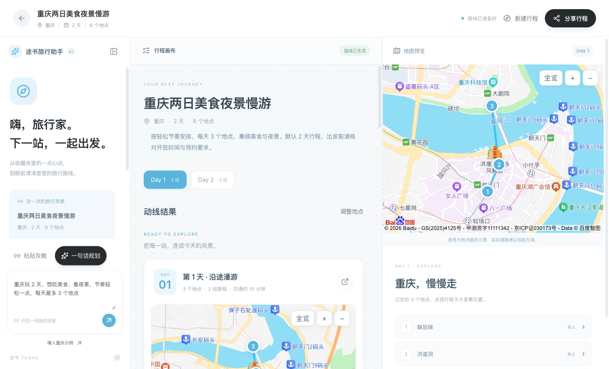
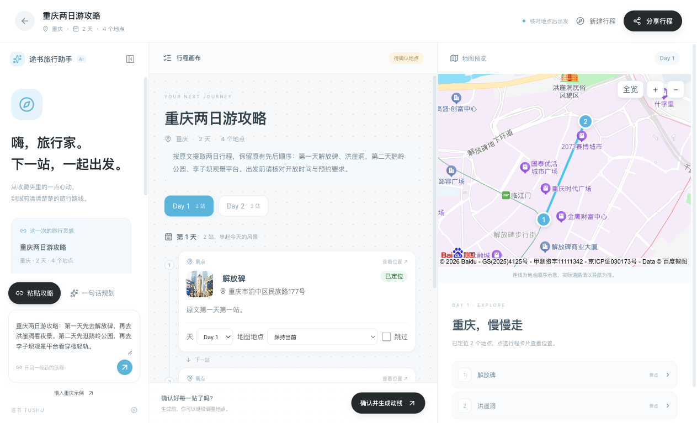
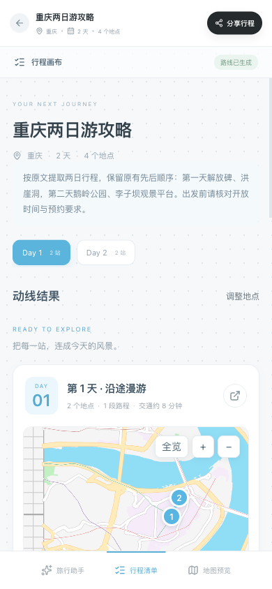

# 双入口行程生成 · 本地验收

本轮新增攻略正文与一句话规划。公开网站尚未部署，下面地址只在这台运行服务的电脑上使用。

## 照着验证

1. 打开 http://127.0.0.1:8000/，中间输入卡片有「粘贴攻略」「一句话规划」。鼠标悬停或点击仍为整卡淡阴影。
2. 点击「一句话规划」，输入“重庆玩 2 天，想吃美食、看夜景，节奏轻松一点”，点右侧箭头。看到整理进度，然后出现按天地点；核对后点「确认并生成动线」。
3. 点击「粘贴攻略」，可粘贴小红书链接或直接粘贴包含目的地、地点的攻略正文。示例按钮只填入输入，不会自动提交。
4. 已完成的真实样例可直接打开：
   - [重庆一句话：2 天 6 地点](http://127.0.0.1:8000/?trip=6007352a)
   - [重庆攻略正文：2 天 4 地点](http://127.0.0.1:8000/?trip=f262f234)
   - [成都三日：3 天 3 地点，待核对](http://127.0.0.1:8000/?trip=b9a7e261)
5. 手机布局可切换底部的旅行助手 / 行程清单 / 地图预览；生成中刷新会继续等待同一任务。

## 真实截图

## 阶段闸门

| # | 检查项 | 是 / 否 |
| --- | --- | --- |
| 1 | 本子阶段输入生成能力实现 | 是；公开发布是后续阶段，尚未上线 |
| 2 | mock 自动化测试已通过 | 是，后端 76/76、前端 9/9 |
| 3 | 真实模型冒烟 | 是，重庆想法、重庆正文、成都想法 3 条均有真实模型与百度定位；前两条完成路线 |
| 4 | 类型检查 / Lint / 生产构建 | 否；类型与构建通过，既有 ESLint 配置仍缺失 |
| 5 | 密钥未进入代码 / 前端产物 / 打包 | 是；未新增凭证，已扫描本轮文本改动与构建产物；未制作分发包 |
| 6 | 重启后数据可恢复 | 是；3 个新增方案及旧方案保留。新任务检查点续跑另经隔离自动化验证 |
| 7 | 桌面与移动端宽度 | 是；390 / 768 / 1280 / 1440px，无横向溢出；已检查真实地图和手机输入 |
| 8 | README 已更新 | 是 |
| 9 | 项目状态已更新 | 是；公网方式、云资源与域名待答复 |
| 10 | 证据包已交付 | 是 |

阶段 3 整体仍待既有问题验收。公网部署前必须完成后端账号隔离、只读分享、调用配额与费用确认；当前不能把本机地址作为公开使用网址。
