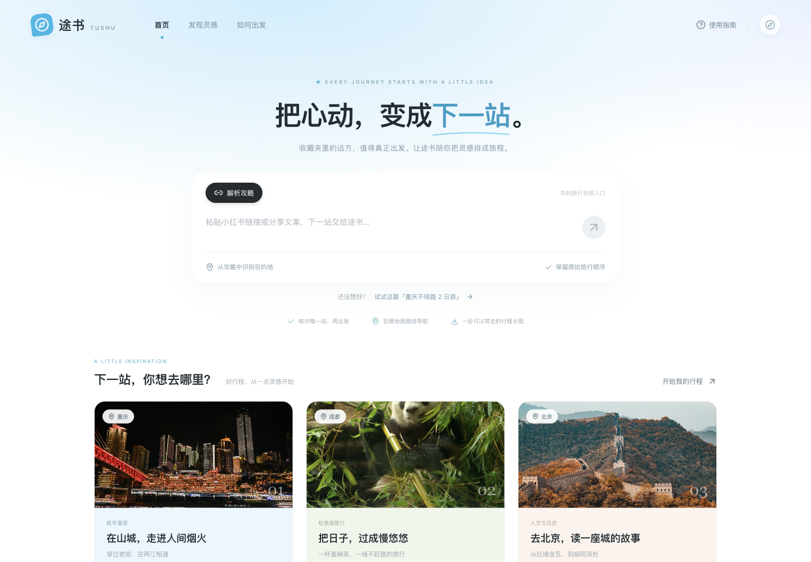
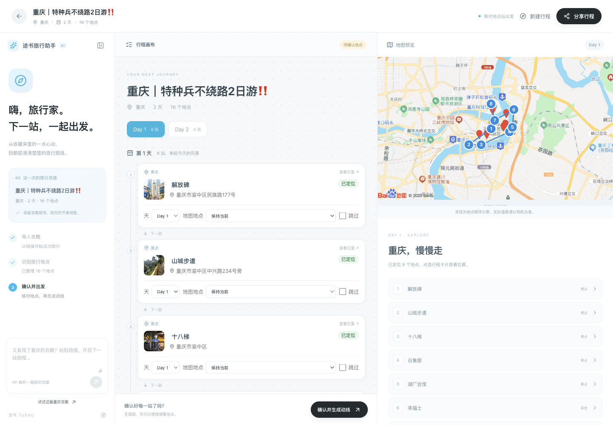
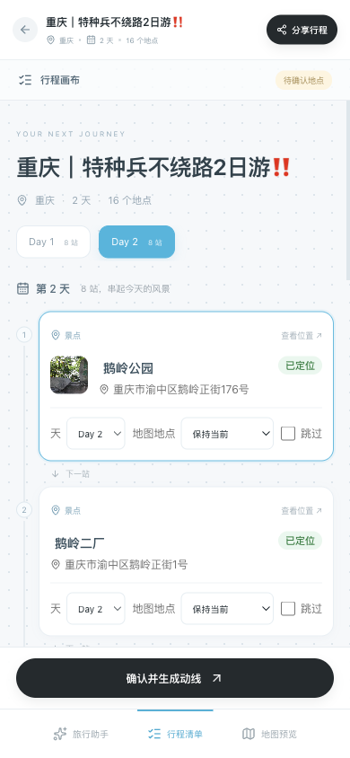
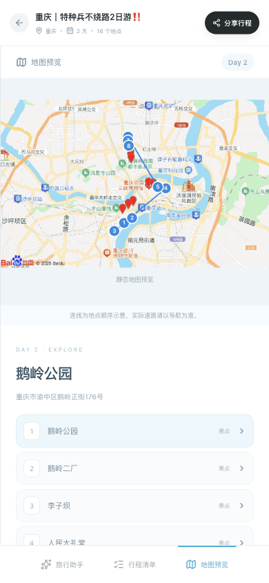
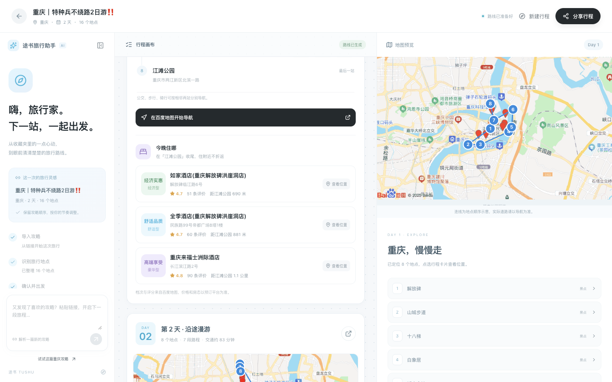
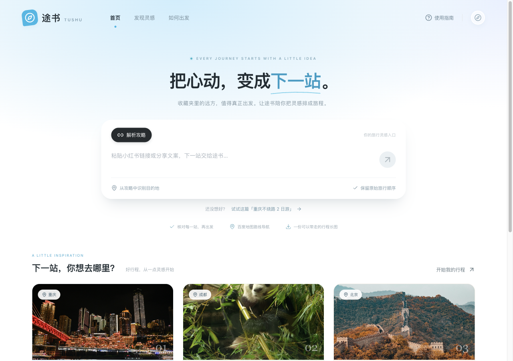
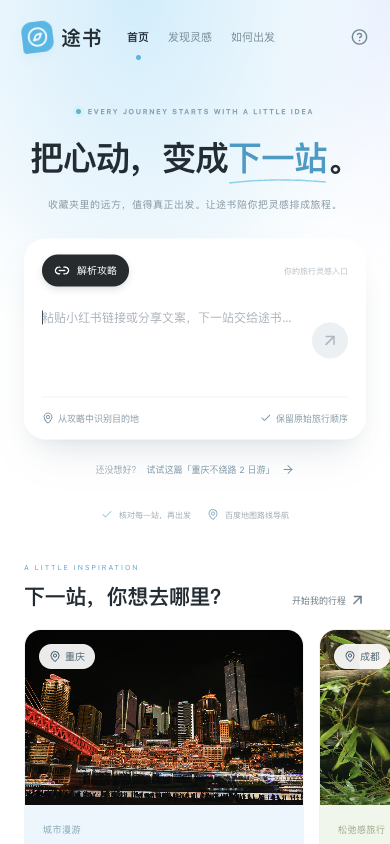

# 最新途书视觉同步 · 验收说明

本次按用户要求只同步视觉，保留当前旅行助手的后端和功能点。视觉来源暂按本机独立旅行规划目录的途书 TUSHU 版本，待用户看预览反馈。截图均为本轮真实本机页面；工作台使用已有真实行程及缓存地图/酒店结果，未调用新的大模型任务。

## 照着点

1. 打开 [首页](http://127.0.0.1:8000/)，看到“把心动，变成下一站”、浅蓝渐变和三张城市灵感卡。
2. 点击“试试这篇「重庆不绕路 2 日游」”：链接进入输入框，页面不跳转；点击发送才会解析。
3. 打开 [地点确认工作台](http://127.0.0.1:8000/?trip=cce9df56)，看到旅行助手、行程画布与地图三栏。
4. 点击 Day 2，再点“在地图定位鹅岭公园”：卡片出现蓝色边框，右侧摘要变为鹅岭公园。地图库未加载时显示现有静态图及编号连线。
5. 打开 [结果与酒店推荐](http://127.0.0.1:8000/?trip=d69cb2c2)，滚动中间行程栏，每天结尾仍有“今晚住哪”，经济/舒适/高端三家。点击“在百度地图开始导航”，电脑显示原有二维码与网页版入口。
6. 在窄窗口或手机浏览器检查底部“旅行助手 / 行程清单 / 地图预览”。实际手机访问需使用同一 Wi-Fi 下电脑的局域网地址；实体手机导航本轮未验。

现有服务仍使用 8000；启动及构建方法见项目 README。本轮没有部署公网。

## 截图

## 阶段闸门

视觉子任务已交付，整个阶段 3 仍未结束。以下如实保留未验项，不使用旧记录充当本轮新验证。

| # | 检查项 | 本轮结果 |
| --- | --- | --- |
| 1 | 本轮范围实现，无提前开发后续阶段 | 是，仅视觉；原功能点保留，视觉来源待用户反馈 |
| 2 | mock 自动化测试 | 是，前端 3/3，后端 42/42 |
| 3 | 真实模型冒烟 | 待验，本轮未重新调用模型；仅真实既有行程回归 |
| 4 | 类型 / Lint / 生产构建 | 部分：类型及生产构建通过；项目既有 ESLint 未配置 |
| 5 | 密钥排除 | 本轮通过：服务端凭证未出现在前端源码/构建；本地配置及产物未上传；既有浏览器专用地图配置保留 |
| 6 | 数据重启恢复 | 待验，本轮未重启用户正在运行的后端，后端源码无变化 |
| 7 | 桌面和移动宽度 | 是，375/390/768/1280/1440 无横向溢出；桌面与390截图已查；实体手机待验 |
| 8 | README 更新 | 是 |
| 9 | 项目状态更新 | 是 |
| 10 | 证据包 | 是，本说明、可打开地址和7张截图 |

## 功能边界证据

本轮修改前后 53 个受保护文件指纹一致，包含后端代码、测试、前端接口/类型、App.tsx 业务流程、地图组件、地图加载入口和依赖清单。当前工作区朋友已有未提交修改均保留。本轮没有改变接口字段、模型调用、路线算法、地图修复、实景图/酒店服务或数据库业务记录。

## 首页输入焦点微调

按用户截图反馈，去掉首页 textarea 的蓝色焦点框；焦点在整张输入卡片内部时，卡片底部出现轻柔阴影，离开后恢复原阴影。仅调整 `visual-refresh.css`，后端与业务逻辑不变。

本轮类型检查、生产构建与前端 3/3 测试通过；桌面实际输入验证 outline 为 none、border 为 0、输入框自身无阴影，整卡有底部阴影；点击外部恢复正常。390px 手机检查通过，无横向溢出。后端、真实模型及重启恢复沿用上表状态，本次未重复验证；阶段3整体状态不变。

验证方法：刷新首页，点击输入框或用键盘 Tab 聚焦；输入文字时无蓝框，整卡下方出现淡阴影；点击标题，阴影回到默认状态。

## 首页文案更新（2026-09-30）

按用户提供的品牌截图，页头中文名改为「途书旅记」；大标题为「把心动，变成下一站」，说明为「把收藏的攻略，变成下一段旅程」，上方英文改为「Trip Flow」并移除前面的蓝色圆点。浏览器标签标题同步品牌名。

刷新 http://127.0.0.1:8000/ 即可核对。桌面及 390px 手机截图见 10、11。

| 本次微调检查 | 结果 |
| --- | --- |
| 文案与圆点调整 | 是：实际页面文字核对通过 |
| 前端自动化测试 | 是：3/3 |
| 类型检查与生产构建 | 是；Lint 尚未配置，沿用阶段待验 |
| 桌面与手机布局 | 是：桌面及 390px 无页面横向溢出 |
| 后端、模型、持久化 | N/A：本次仅文案，没有更改业务逻辑 |
| 密钥排除 | 是：没有新增密钥或配置 |
| README、项目状态与证据 | 已更新 |

本次不作为整个阶段 3 完成声明。

## 首页导航、标题与输入阴影更新（2026-09-30）

三个导航标签相对页面整体居中，600px 及以下独立一行居中，避免与品牌重叠。主标题改为「灵感出发，自在抵达。」，保留「自在抵达」蓝色与下划线。输入卡片鼠标悬停或输入聚焦均显示底部淡阴影；移开且失焦后恢复默认，输入框仍无蓝色焦点框。

打开 http://127.0.0.1:8000/ ，将鼠标移到输入卡片上，再点输入框后移开鼠标，可核对阴影；点击卡片外部恢复。截图见 12、13。

| 本次调整检查 | 结果 |
| --- | --- |
| 三项界面调整 | 是：页面实测文字、居中与悬停/聚焦/失焦状态通过 |
| 前端自动化测试 | 是：3/3 |
| 类型检查与生产构建 | 是；Lint 沿用既有待配置项 |
| 桌面与手机 | 是：1440/1024/768/600/390/375px 导航居中偏差 0px、无页面横向溢出、无品牌重叠 |
| 密钥排除 | 是：未新增配置或密钥 |
| 后端、模型与持久化 | N/A：仅页面文案与样式调整 |
| README、状态与证据 | 已更新 |

本次不代表阶段 3 整体验收完成。
